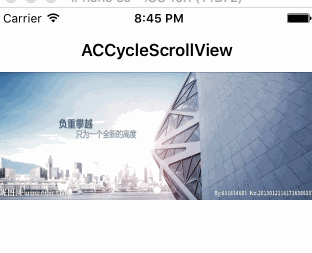
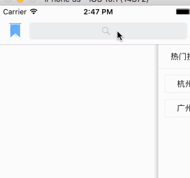

# iSwfit
学习 Swfit

### ACCycleScrollView
简单的用 swfit 封装 banner 轮播的控件



```
let imageNames = ["banner1","banner2","banner3","banner1","banner2","banner3"]
        
let imageUrls = ["http://ww4.sinaimg.cn/large/934b5ef8gw1fa90luk4wyj20hl064gls.jpg",
"http://ww1.sinaimg.cn/large/934b5ef8gw1fa90n84qcoj20jh064q3u.jpg",
"http://ww2.sinaimg.cn/large/934b5ef8gw1fa90nq20vhj20ia064aau.jpg"]
        
let rect = CGRect(x: 0, y: 0, width: SCREEN_WIDTH, height: SCREEN_WIDTH/5.0 * 2.0)
cycleScrollView = ACCycleScrollView(frame: rect, images: imageUrls as NSArray, timeInterval: 3.0)
        
self.view.addSubview(cycleScrollView!)
```    

### ACSearchViewController
一个搜索 ＋ 热门搜索 ＋ 搜索纪录的控件

  

### NotificationDemo  
一个 iOS10 UserNotification 推送 demo


