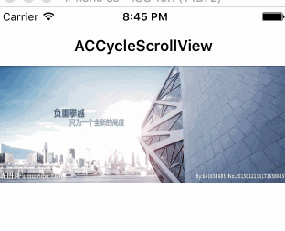
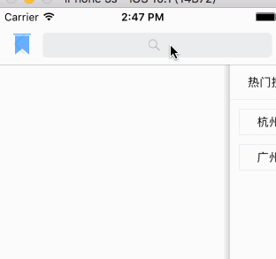

# iSwift
学习 Swift

## ACCycleScrollView
简单的用 swfit 封装 banner 轮播的控件



```
let imageNames = ["banner1","banner2","banner3","banner1","banner2","banner3"]
        
let imageUrls = ["http://ww4.sinaimg.cn/large/934b5ef8gw1fa90luk4wyj20hl064gls.jpg",
"http://ww1.sinaimg.cn/large/934b5ef8gw1fa90n84qcoj20jh064q3u.jpg",
"http://ww2.sinaimg.cn/large/934b5ef8gw1fa90nq20vhj20ia064aau.jpg"]
        
let rect = CGRect(x: 0, y: 0, width: SCREEN_WIDTH, height: SCREEN_WIDTH/5.0 * 2.0)
cycleScrollView = ACCycleScrollView(frame: rect, images: imageUrls as NSArray, timeInterval: 3.0)
        
self.view.addSubview(cycleScrollView!)
```    

## ACSearchViewController
一个搜索 ＋ 热门搜索 ＋ 搜索纪录的控件

  

## NotificationDemo & ExtensionDemo  

一个 iOS10 UserNotification 推送 demo 和 一个 App Extension 的 demo, 集成了 Share 和 Today 扩展

 
 


## ACWaterfallLayout

一个继承自 UICollectionViewLayout 实现的瀑布流


```
collectionView.collectionViewLayout = layout

func sizeForItem(_ collectionView: UICollectionView, layout collectionViewLayout: UICollectionViewLayout, indexPath: IndexPath) -> CGSize {
        return indexPaths[indexPath.row].size
}

```

实例化一个 ACCollectionViewLayout 对象，实现他的代理方法既可以使用瀑布流的功能，目前只支持一个 section，未完待续

### TODO
- [ ] 支持多个 section
<<<<<<< HEAD
- [x] 加上 sectionHeader 和 sectionFooter
=======
- [ ] 加上 Header 和 Footer
>>>>>>> e9f2567... add: waterfullLayout
   

